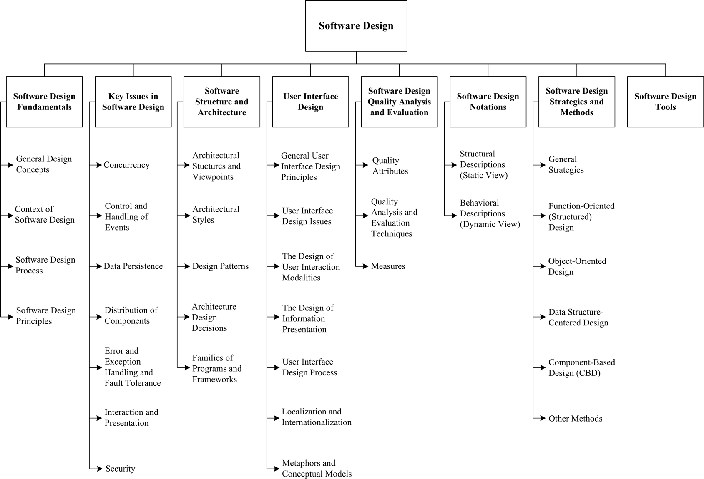
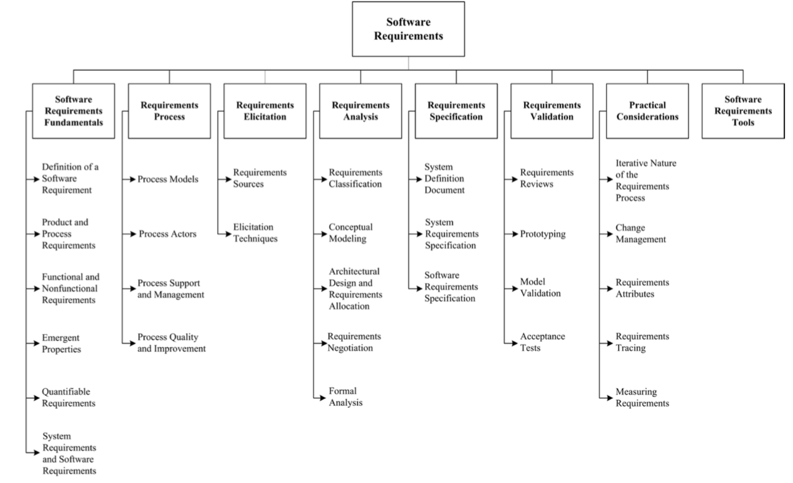

# Outline
## What will I learn
### errors or misunderstandings of Software Requirements or Designs are expensive to correct during later stages and may lead to project failure
        - Software Engineering
        - Requirements
        - Design
        - Software Metthodologies
        - Software Processes

        
# Asking right question and useful information from client

# Software Engineering
    Two words:
        - Software is a set of instructions, data or programs used to operate computers and execute specific tasks
        - Engineering applies systematic, scientific and well-defined processes to produce a good quality product
    SE is a creative processe in which 
        - these are few right/wrong answers
        - but nonetheless some requirements and designs are (much) better than others

# Requirements
    - Software capability needed by a user to solve a problem or to achieve an objective
    - SC that must be met or possessed by a system or system component to satisfy a contract, standard, specification or other fomally imposed document

# Design
    - processe
    - result

# Software Processes
    - is a set of interrelated activities and tasks that transform input work products into output work products
    - ACTIVITIES are how people spend their time: planning, programming, testing, meeting
    - process is how activities fit together time, often with pre and post-conditions for the activities. e.g. design review happens 2 days after designs are sent to participants and produces a list of recommendations

# Requirements and designs are important
    - EVERY project has uncertainty <-Requirement deal with this
    - Engineers need something to work toward
    - "Is the solution fit-for-purpose"
    - Test program is to demonstrates requirements are met: that is effective tool to help met client's needs -> get money

# How to learn
 - Classify types of software requirements and designs
 - Apply requirements and design processes appropriate for a given scenario
 - Assess qulity attributes of given requirements and designs
 - Utilise design patterns and idioms
 - Document software design rationale using discourse conventions of discipline
 - Select a software architecture appropriate for a particular context

 
 
