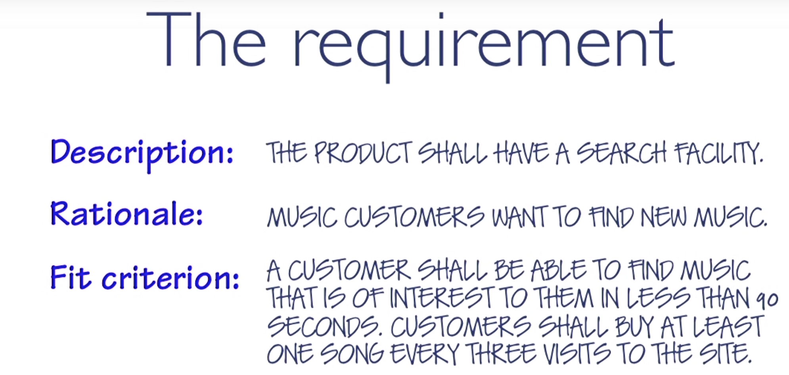
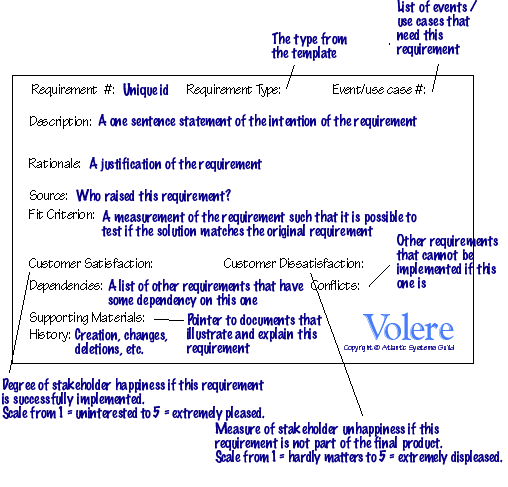
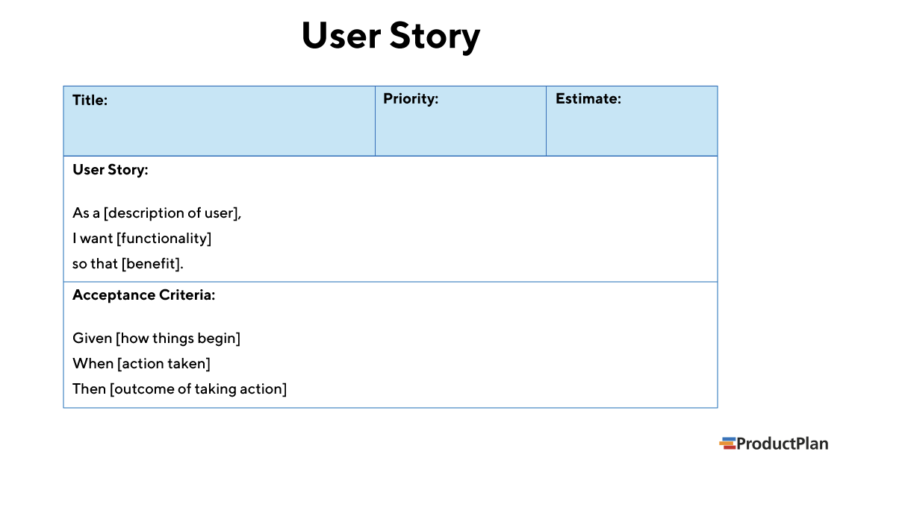
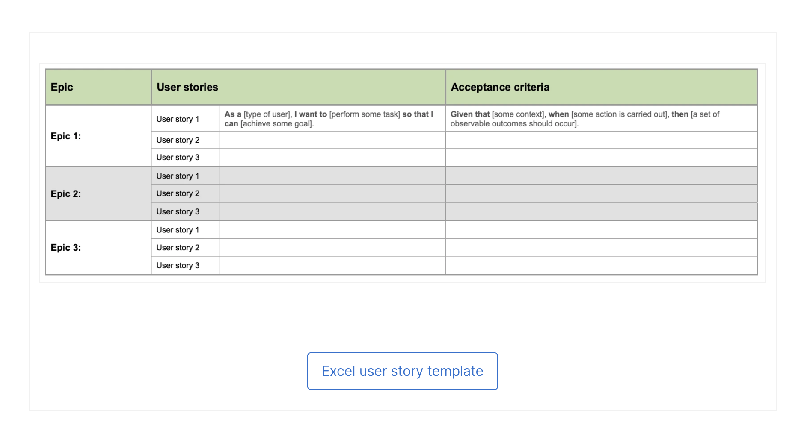
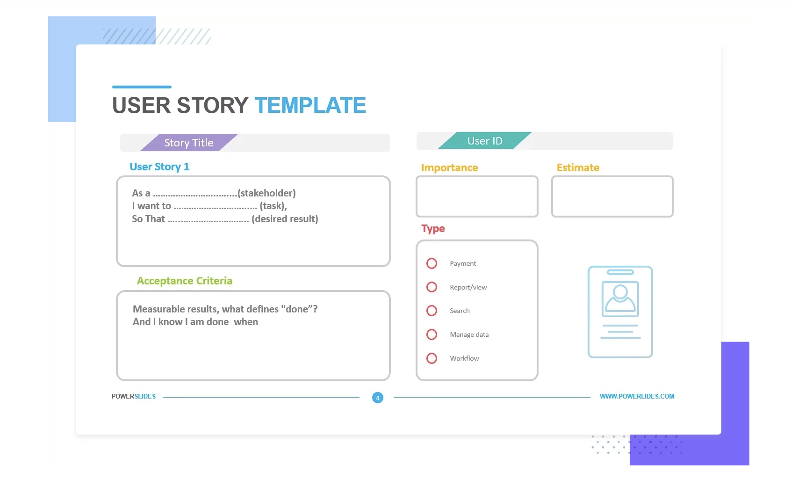
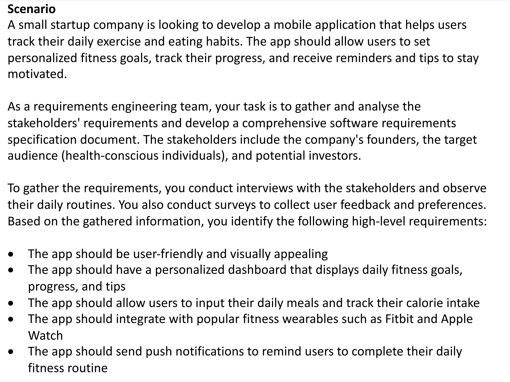

# Users
# Customers = "the people that pay"
# Actors
- in UML, someone or something outside the system that interacts with the system
- Note: it can be of interest to specify which actor initiates that action
# User Stories
- User stories are often written early in the Software development
- The idea is to capture "raw" user needs
- The purpose of a user story is articulate how a piece of work will deliver a particular value back to the customer
    - User stories provide value back to the customer and other stakeholders
# Benefits of User Stories
- Stories keep the focus on the user
    - A TODO list keeps the team focused on tasks that need checked off, but a collection of stories keeps the team focused on solving problems for real users
- Stories enable collaboration
    - 
- Stories drive creative solutions
- Stories create momentum

# User story format
    As a [role]
    I want [funcationality]
    So that [business value]

- As Max. I want to invite my friends. so we can enjoy this service together
- As Sascha, I want to organize my work, so I can feel more in control
- As a manager, I want to be able to understande my colleagues progress, so I can better report our success and failures $$$ business value

## bad example:
    As a bank customer
    I want online access to my account
    So that I can see my balance 24/7 $$$ does not see any business value
## better eg
    As a bank customer
    I can have frequent and convenient connectioon with my account and its activity
    So that I can feel confident that I always know my financial position
# How to write good User Stories
- needs:
    - When you write a user story, what you're describing is a "raw" user need
    - It's something that the user needs to do in her day-to-day job
    - Even if you never build any software for her, then that need will still exist
    - With an agile appoarch Testers are involved to assist review of User Stories to ensure they are "reasonable/testable"
        - Tester (vs developers) typically better represent real users.
        - Tester think and act like users 
            - while developers act like developers

# Quality Attributes of User Stories
- User stories are easy for users to read

# The snow card
- Snow card field can be continuously filled in.

# Use cases
- an abstraction that describes all possible scenarios involiving the described functionality focus is on completeness

# productplan

# Epic User Story

# Powerslides

## 1
- As a user
- I want to 
    - Track my daily exercise
    - Eating habbits
    - Set personalised fitness goals
    - Track their progress
    - Receive reminders and tips to stay motivated
    - enhance gym experience
- So that I can be healthy and fit

## 2
- As a user
- I want to have a personalised dashboard 
- So that I can be informed with my daily fitness goals, progress and tips

## 3 
- As a user 
- I want to input my daily meals
- So that I can track my calorie intake

## 4
- As a user
- I want to link my smart wearables like Fitbits or Apple Watch
- So that I can have more convenient way to check my statistics

## 5
- As a user
- I want to get notifications
- So that I can be reminded to complete my daily fitness routine