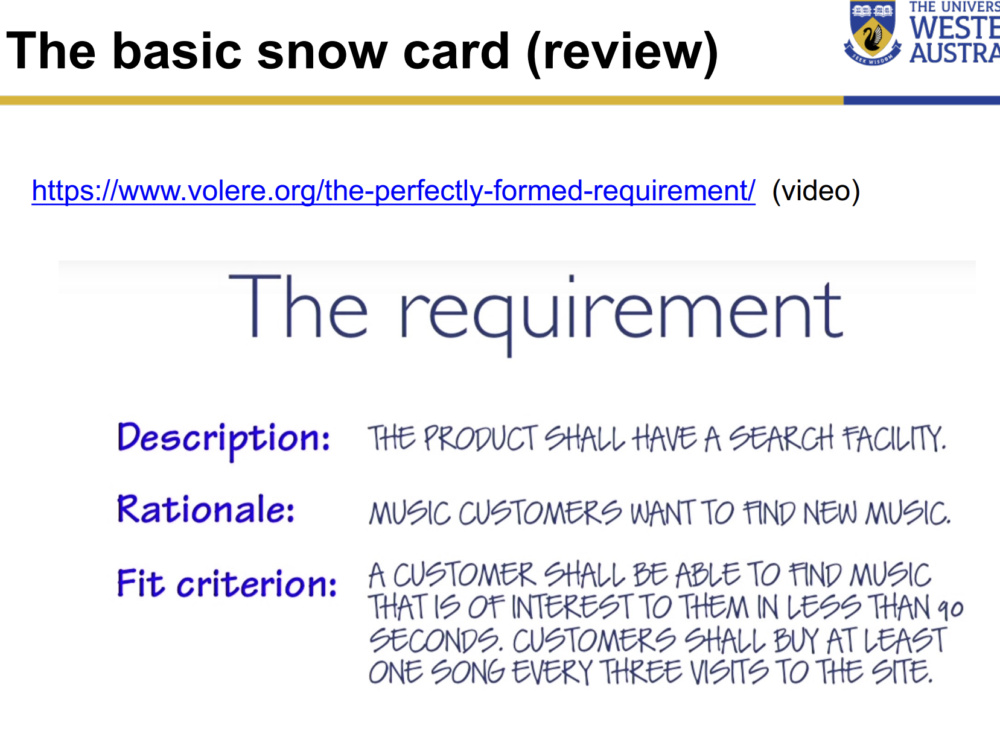

# Requirement Analysis

- What is
- This topic is concerned with the process of analyzing requirements to
  - **Detect and resolve conflicts** between requirements
  - **Discover the bounds** of the software and how it must interact with its organizational and operational environment
  - **Elaborate** system requirements to derive software requirements

# Types of Requirements

- Functional
- Non-functional
- Performance
- Maintainability
- Interoperability
- Useabaility
- Safety
- Reliability
- Security
- Privacy
- Product
- Process
- Emergent

# More requirements classifications

- Requirement Priority
  - The higher the priority the more essential the requirement is for meeting the overall goal of the SW
- Requirement Scope
- Requirement Volatility

# Viewpoints of Requirements

- interactor viewpoints
- indirect viewpoints
- domain viewpoints

# Putting this into Practice

# Requirements Negotiation

# Conflict / Negotiation

- Conflict resolution

# Detecting Conflicts

# Use order of Priority

# MoSCoW method

# Formal Methods

- Construct a mathematical model of the requirements
- Use logical analysis to verify properties and identify inconsistencies
- Most methods have tool support and some have automatic analysis
- Popular models include 1st order logic, set theory, temporal logic, state machines

# Weaknesses

- What are the weaknesses of these 3 strategies for large projects?

# Resolving conflicts

# Why?

-

# Negotiation for agile software development

# Win-Win Spiral

- Multi-stakeholder involvement with coordination and collaboration based on
  - **Win conditions**
  - **Conflict/Risk/Uncertainty specifications**
  - **Points of Agreement**

# Feasibility Studies

- INPUT
  - set of preliminary business requirements
  - an outline description of the system
  - how the system is intended to support business processes
- OUTPUT
  - a report recommending whether or not it is worth carrying on with the requirements engineering and system development process

# Requirements Evolution

# Issues

- issues
- definitions
- techniques

# Traceability tables

- Uniquely number all requirements
- Identify specific aspects of the system or its environment classified by
