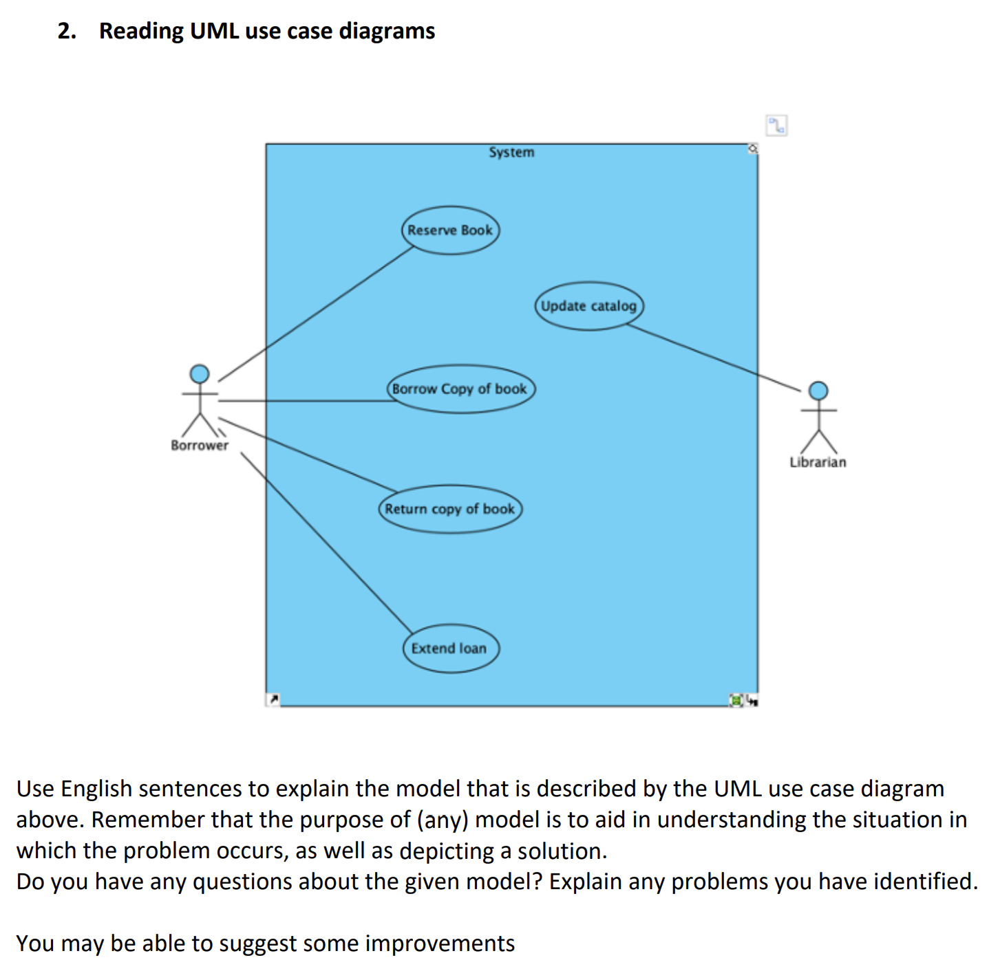
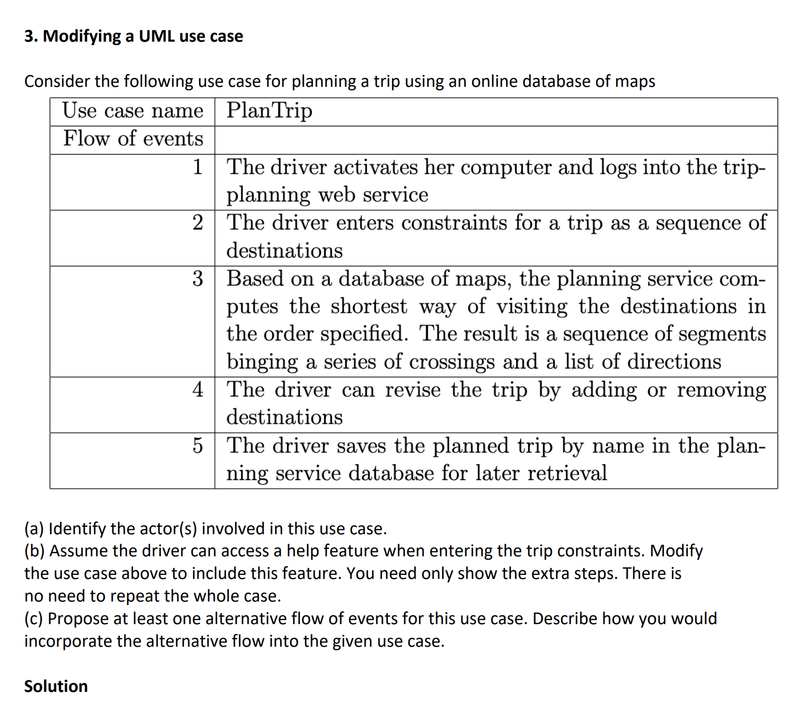

- What is the difference between a use case and a scenario
  1.  Use cases describes how a user is to do with the system so that the user can finish a specific issue.
  2.  Scenario is about the detailed steps of the use case, including each actions that a actor will have to do with the system.

# From chatgpt:

```
Use cases are a technique used in software engineering to describe the behavior of a system from the perspective of an external user or actor. A use case represents a specific goal or task that a user wants to achieve by interacting with the system. It describes the steps required to achieve that goal and the interactions between the user and the system to accomplish that goal. A use case typically includes the preconditions and postconditions for the user to successfully complete the task.

On the other hand, a scenario is a detailed description of a particular path through a use case. It provides a step-by-step description of the actions that the user or actor takes to complete the task. A scenario describes the sequence of events that occur when a user interacts with the system to complete a specific use case. A scenario may also include variations or alternative paths that a user can take depending on their choices or inputs.

To summarize, a use case is a high-level description of a user's goal or task, while a scenario provides a detailed description of the specific steps the user takes to achieve that goal within the use case.
```

- What does a UML use case diagram show?
  1.  Actors,
  2.  System boundary,
  3.  Use cases,
  4.  Relationships,
      1. Association
      2. Include
      3. Extend



- Librarian needs more use cases

- Modifying a UML use case
  

1. Driver
2. The driver can enters constraints for a trip with the suggestions provided by the planning service
3. ->a1: the shortest way can not be generated because of outdated data -> a2: The driver have to re-type a new set of constraints for the same trip. ->3
4. a1->b1: The driver closed the system. (end of use case)
