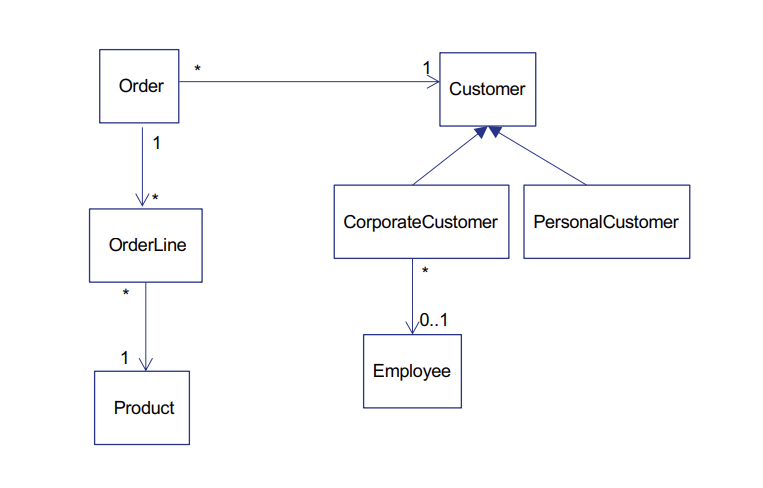
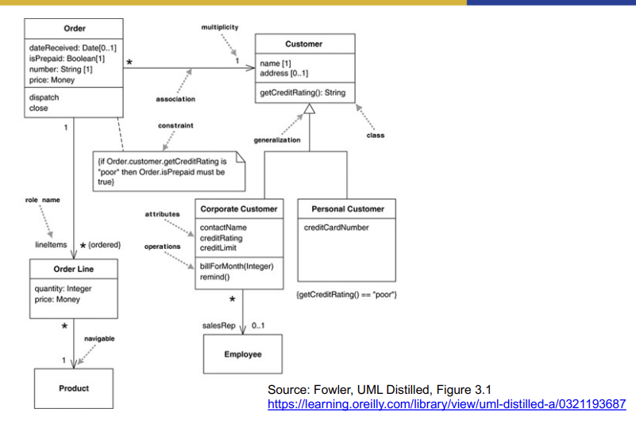
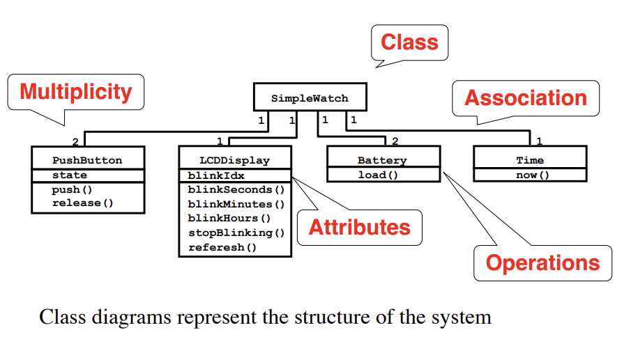
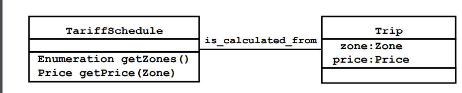
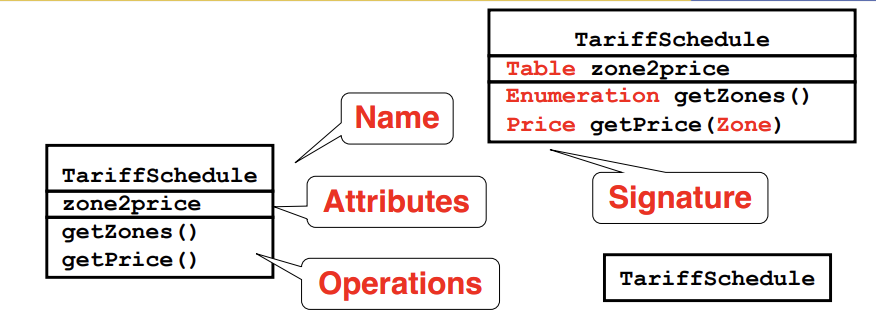
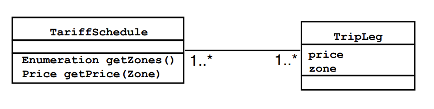
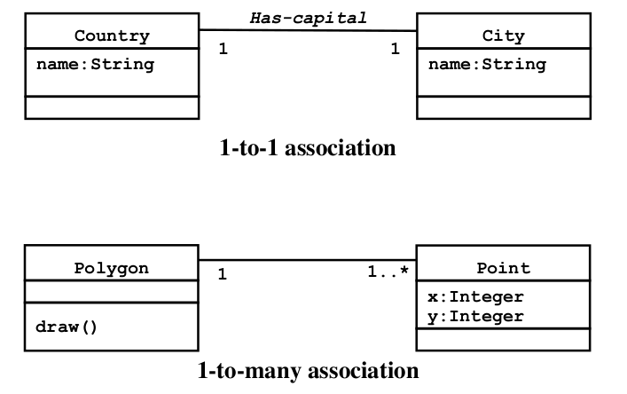
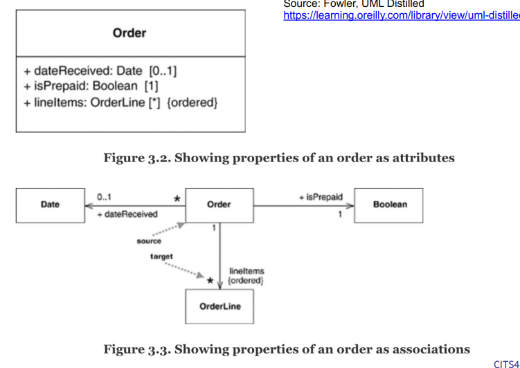

# Class models

# Key Topics

1. UML Class diagrams (what they are for and how to read them)
2. Discovering objects (noun discovery method) and associations (Class, Responsibilities, Collaboration(CRC) method)

# Requirements Analysis Framework

- Requirements analysis generates an analysis model with 3 parts
  - Functional model: use cases & scenarios
  - Static analysis object model: class & object diagrams
  - Dynamic model: statechart & sequence diagrams (later in the unit)
- This week we will look at static class models
- Goal is to investigate the problem domain as far as possible before moving to the solution domain (for design & implementation)

# 1. UML Class diagrams

# Why build class models?

- Why do we build class models? In order to ...:
  1. Build, as quickly and cheaply as possible, a system that satisfies our current requirements
  2. Build a system which will be easy to maintain and adapt to future requirements

# What is a UML class diagram?

- A class diagram describes the types of objects in the system and the various kinds of static relationships that exist among them.
- Class diagrams also show the properties and operation of a class and the constraints that apply to the way objects are connected.

# UML class diagram for an online shop (example 1)



# UML Class diagram interpretation

1. 1 customer has 0 or more orders, but each order has a single customer
2. An order comprises one or more order lines
3. Many order lines refer to a product
4. Corporate customer and personal customer are special types of customer
5. A corporate customer is supported by 0 or 1 sales reps who are order company employees - that is they may have a sales rep or may not

# Example 1 with more detail



# Example 2



# Index

- Classes
- Associations
- Attributes
- Generalization
- Constraints

# Class Diagrams



- Class diagrams represent the structure of the system
- Class diagrams are used
  - during requirements analysis to model problem domain concepts
  - during system design to model subsystems and interfaces
  - during object design to model classes

# Classes



- A **class** represent a concept
- A class encapsulates state **(attributes)** and behavior **(operations)**
- Each attribute has a **type**
- Each operation has a **signature**
- The class name is the only mandatory information

# Associations



- Associations denote relationships between classes
- _A_ is associated with _B_ is: _A_ has to know about _B_
- The multiplicity of an association end denotes how many objects the source object can legitimately
- reference

# 1-to-1 and 1-to-Many Associations



# Multiplicity

- The multiplicity of a property is an indication of how many objects may fill the property
- The most common multiplicities you will see are
  - 1 (An order must have exactly one customer)
  - 0..1 (A corporate customer may or may not have a single sales rep)
  - (A customer need not place an Order; there is no upper limit to the number of Orders. That is, zero or more orders)
- If I have a multivalued property, I prefer to use a plural form for its name.
- In attributes, you come across various terms that refer to the multiplicity
  - Optional implies a lower bound of 0
  - Mandatory implies a lower bound of 1 or possibly more
  - Single-valued implies an upper bound of 1
  - Multivalued implies an upper bound of more that 1: usually \*

# Practice

# Attributes

- Properties represent structual features of a class. As a first approximation, you can think of properties as corresponding to fields in a class
- The attribute notation describes a property as a line of text within the class box itself
- Properties are a single concept, but they appear in two quite distinct notations: attributes and associations
- Although they look quite different on a diagram, they are really the same thing

# Attribute or Associations



# Which to use?

- With two notations for the same thing, the obvious question is
- Why should you use one or the other?
- In general:

  - **Attribute** for small things,
    - such as dates or Booleans - in general, value types (page 73)
  - **Associations** for more significant classs, such as customers and orders

- Tend to prefer to use class boxes for classes that are significant for the diagram, which leads to using associations, and attributes for things less important for that diagram
- The choice is much more about emphasis than about any underlying meaning

# Programming Interpretation

- As with anything else in the UML, there's no one way to interpret properties in code.
- The most common software representation is that of a field or property of your programming language.
- So the Order Line class from Figure 3.1 would correspond to something like the following in Java:

```java
  public class OrderLine...
  private int quantity
  private Money price
  private Order order
  private Product product
```

- If an attribute is multivalued, this implies that the data concerned is a collection (ArrayList etc in java)

# Generalization （泛化）

# What is generalization?

- A typical example of generalization involves the personal and corporate customers of a business
- They have differences but also many similarities.
- The similarites can be placed in a general Customer class (the supertype)
- Personal Customer and Corporate Customer are subtypes

# Button Generalization

- Generalization relationships denote inheritance between classes.
- The children classes inherit the attributes and operations of the parent class.
- Generalization simplifies the model by eliminating redundancy

# Constraints

- UML class diagrams indicate constraints via association, attributes and generalizations
- But other types of constraints may also need to be capture
- UML allows you to use anything to describe constraints
- The only rule is you put them inside curly braces {}
- Natural or formal language can be used to describe the constraint

# Summary

1. UML Class diagrams (what they are for and how to read them)
2. Discovering objects (noun discovery method)
3. Discovering associations (Class, Responsibilities, Collaboration (CRC) method)

# UML class diagrams

- UML Class Diagrams describe the static structure of the system
  - classes
  - class attributes
  - associations between classes
  - association roles and multiplicity（多重性）

# Focus

- In CITS4401 we will study these elements
  - classes, associations, attributes, generalization, and constraints

# When to Use Class Diagrams

- Class diagrams are backbone of the UML, so you will find yourself using them all the time
- The trouble with class diagrams is that they are so rich, they can be overwhelming to use

### Tips

- Don't try to use all the notations available to you
  - Start with the simple stuff: classes, associations, attributes, generalization, and constraints. Introduce other notations only when you need them
- Work hard on keeping software out of the discussion and keeping the notation very simple
- Don't draw models for everything; instead, concerntrate on the key areas. It is better to have a few diagrams that you use and keep up to date than to have many forgotten, obsolete models
- The biggest danger with class diagrams is that you can focus exclusively on structure and ignore behaviour
  - Therefore, when drawing class diagrams to understand software always do them in conjuction with some form of behavioural technique. If you're going well, you'll find yourself swapping between the techniques frequently
