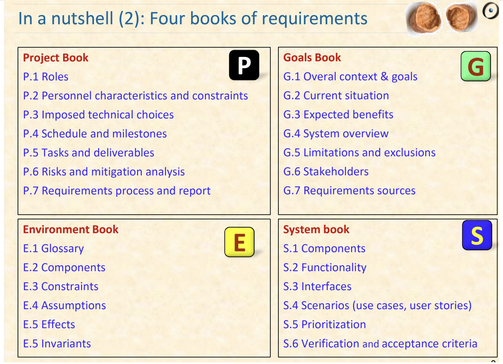

# Specification & Validation

# Key ideas

- Requirements Specification Document
  - **Tell me**

# The requirements specification

- Official statement
- Contract: Client and Developer
- Reference tool: Clients, designers, programmers, testers and maintenance engineers

- In planned methodologies
- It is the **official statement** of what is required of the system developers
- It forms the basis of a system **contract** between client and developer
- It is **reference tool** used by clients, designers, programmers, testers and maintenance engineers.

# The problems of requirements

- What goals are we trying to satisfy?
- How do we identify the scope and properties of the solution space?
- Software Engineers differ in their views about the best way to answer these questions.
- We will look at both planned and agile approaches and something in between.

# Waterfall vs Agile

# IEEE Standard

# Requirements Specificatioon Document Template(IEEE)

# PEGS (Meyer)

- The aim is to execute
  - a **project**
  - in a certain **environment**
  - to achieve certain **goals**
  - by developing a **system**

# System vs Environment

- Compare:
  - "The gate shall close in at most 3 seconds"
  - "Trains shall be assumed to travel at no more than 300 Km/H"

# Project vs Goals

- Project Requirements concern **how** the SW development will be **carried out** (time, tech stack and so on)
  - **e.g. The system will be implemented using React and Express**
  - **e.g. The system will be delivered in 3 sprints of 1 month each with final deliverable on 31 May 2021.**
- Goals Requirements capture the business goals of the system why we are building it
  - **e.g. The system will enable admin staff to process 4 student applications per hour instead of 2 hours per application now**

# Requirements Sources

# PEGS requirements repository

- Project Book
- Goals Book
- Environment Book
- System Book
- 

# PEGS books

- Notes on the plan
  - Does not assume a linear document
  - Elements can be anywhere but should be recorded in the repository
  - Tools can produce linear version
  - Templates (Word etc) will be available
  - We are writing a companion book applying these ideas to a large practical example

# Attributes of a good requirements specification

- Concise
- Complete
- Unambiguous
- Testable
- Consistent
- Feasible
- Modifiable
- Traceable
- Specifies external system behaviour only
- Specifies constraints on the implementation
- Easy to change
- Reference Tool for maintainers
- Records forethought about the life cycle
- Characterises acceptable responses to undesired events

# Summary

- Requirements Specification
  - Document or Repository
  - Basis for client-developer contract
- Desirable attributes
  - Concise, complete, consistent, unambiguous, testable, modifiable, traceable, feasible
- Choose an appropriate method for your project
  - Agile: User stories
  - In between: PEGS
  - Waterfall: IEEE Standard
