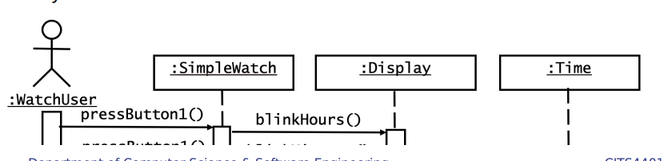
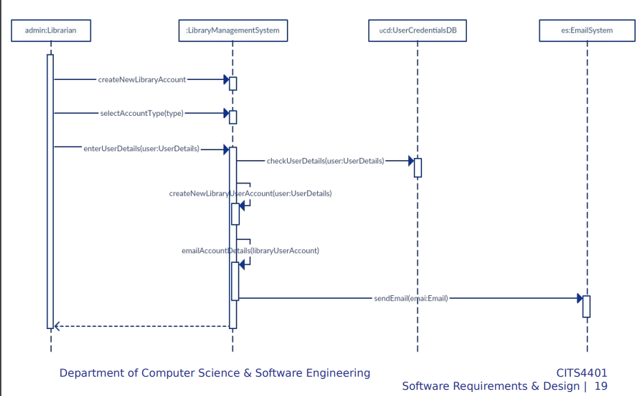

# Dynamic Modelling (part 1) UML Sequence Diagrams

# Lecture Overview

- What does a UML sequence diagram look like?
- What are the components of a sequence diagram?
- How do you create a sequence diagram?
- What about more complex situations?
- When to use a sequence diagram (and when not)

# Interation in UML

- Interaction diagrams describe how groups of objects collaborate in some behaviour
- The UML defines several forms of interaction diagram, of which the most common is the sequence diagram
- Typically, a sequence diagram captures the behaviour of a single scenario
- The diagram shows a number of example objects and the messages that are passed between these objects within the use case

# UML sequence diagram

- picture

# Sequence Diagrams

- Sequence diagrams represent
  - the interaction of participants (horizontally)
  - over time (vertically)
  - using messages to communicate
- Most of the time, you can think of the participants in an interaction diagram as objects (see Fowler for discussion)

- picture description:

  - "sendUnsentEmail" : messages
  - ":Server" : Object or Participant
  - "dotted line" : Object lifeline
  - "Squares" : Activation box
  - Time axis: from up to bottom

- Sequence diagrams represent the interaction of objects (horizontally) over time (vertically)
- SD ties use cases with objects, showing how the behaviour of a use case is distributed amongst its participating objects
- SD provide a shift in perspective, allowing developers to find missing objects or resolve uncertainties
- Developers should focus on problematic or under-specified functionality first, since drawing Sequence Diagrams can be time consuming

# Objects + Flow

- The most important components in a sequence diagrams are:
  1. The participating objects - what are the objects associated with the use case in consideration
  2. The flow of events between these objects - what are the messages that might be sent from the sender object to the receiver objects?
- Most of the main objects should have already been identified when we come to analyze sequence diagrams
- Through dynamic modelling, new objects that were not identified may emerge

# Get the Flow of Events from a Scenario

- Flow of events from "Dial a Number" Use case:
  - Caller lifts receiver
  - Dial tone begins
  - Caller dials
  - Callee answers phone
  - Ringing stops
  - ...
- Heuristic:
  - An event always has a sender and a receiver. Find them for each event. These are the objects participating in the use case

# Conventions for Sequence Diagrams

- 
- Layout:
  - 1st column: Corresponds to the actor who intiated the use case
  - 2nd column: Should be a boundary object with which the actor interacts to initiate the use case
  - 3rd column: Should be the control object that manages the rest of the use case
  - 4th column: An entity object representing long-lived info tracked by the system
- Object Creation:
  - Control objects are created by boundary objects initiating the use case
  - Other boundary objects are created by control objects
- Object Access:
  - Entity objects are accessed by control and boundary objects
  - Entity objects should never access boundary or control objects: This makes it easier to share entity objects resilient technology-induced changes in boundary objects

# Example: Order pricing scenario

- We have an order for some products made by a customer
- We are going to invoke a command to calculate its price
- To do that, the order needs to look at all the line's products
- Finally, the order needs to compute an overall discount, which is based on rules tied to the customer

# Order Pricing Solution 1

- SDs focus on interactions
- SDs are not flow charts so don't try to capture loops or conditions
- Note the return arrow is only used for the getProduct call
- It is for showing the correspondence
- Some people use returns for all calls, but I prefer to use them only where they add information; otherwise, they simply clutter things

# Order Pricing Solution 2

picture

# Worked Example: Create new online library account

- Here are the steps:
  - The **librarian** _requests_ the **system** to _create_ a new online library account
  - The librarian then _selects_ the library user account type
  - The librarian _enters_ the user's details
  - The user's details are _checked_ using the user **Credentials Database**
  - The new library user account is _created_
  - A summary of the new account's details are then **_emailed_ to the user**

# Step 1: Identify participants

- **librarian**, **system**, **Credentials Database**, **emailed to the user**

# Step 2: Identify events

- _requests_, _create_, _selects_, _enters_, _checked_, _created_, _emailed_

# Sequence diagram:

# More complex examples

- You don't need to make sequence diagrams for simple flows
- But for more complex situations they are good for resolving ambiguity and uncertainty

# When to use Sequence Diagrams

- You should use sequence diagrams when you want to look at the behaviour of several objects within a single use case
- Sequence diagrams are good at showing collaborations among the objects
- they are not so good at precise definition of the behavior
- If you want to explore multiple alternative interations quickly, you may be better off with CRC cards, as that avoids a lot of drawing and erasing. It's often handy to have a CRC card session to explore design alternatives and then use sequence diagrams to capture any interactions that you want to refer to later

# Summary

- What does a UML sequence diagram look like?
- What are the components of a sequence diagram?
  - Objects (participants) + lifelines + messages
- How do you create a sequence diagram?
  - Start with a scenario; actors to participants; identify messages; and iterate if needed
- What about more complex situations?
  - SDs are good for resolving ambiguity and uncertainty
- When to use a sequence diagram (and when not)
  - To understand the behaviour of several objects in a single use case
  - Where collaborations between objects needs to be explored
