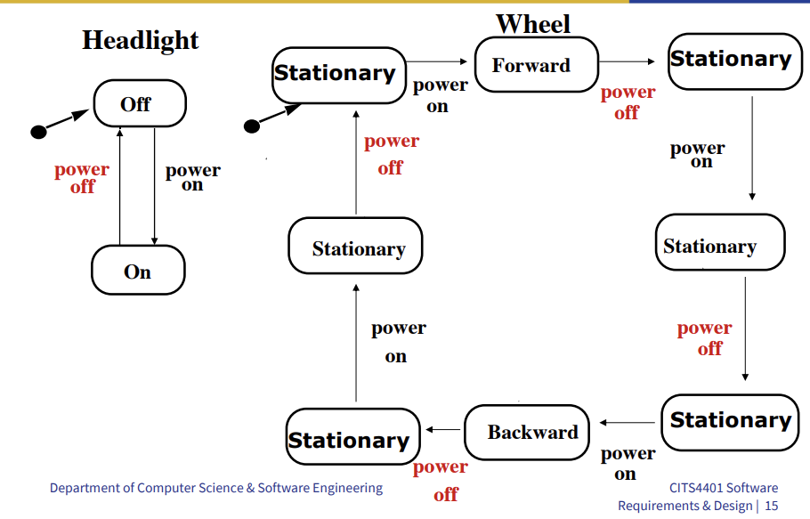

# UML State Diagrams

# Finite state machine

picture

# UML Statechart Diagrams

- A UML state diagram is a notation for describing the sequence of states an object goes through in response to external events.
- UML state machines are extensions of the finite state machine model
- A state is a condition satisfied by the attributes of an object
- A transition indicates a move from one state to another
- An event is a potential trigger for a change of state

# State machine

picture

# Ex 1. Interaction with PC (V1)

picture

# UML Statecharts

- State machine models show how individual objects change their state in response to events. They are represented in the UML using statechart diagrams
- While sequence diagrams are used to model the combined behaviour of a group of objects in the system, the statechart diagrams are used to model the behaviour of a single object in response to external events
- In the context of behaviour modelling, 2 different characterizations of states must be considered:
  1. The state of each class and
  2. The state of the system as observed from the outside as the system performs its function

# Interaction with PC (V2)

picture

# UML Statechart Diagram Notation

picture

- UML notation based on statecharts by Harel in 1987
  - Added are a few object-oriented modifications
- A UML statechart diagram (or UML state machine) can be mapped into a finite state machine (FSM)

# Statechart Diagrams

- Graphs whose nodes are states and whose directed arcs are transitions labelled by events
- States capture conditions which hold for a period of time
  - e.g. light is on, light is off
- Events change the state (except internal)
  - e.g. turning the light on, turning the light of
- Statechart diagrams represent behaviour from the perspective of a single object only
  - An object model with a set of objects must be represented by a set of state diagrams

# State

- An abstraction of the attributes of a class
  - State is the aggregation of several attributes of a class
- Basically an equivalence class of all those attribute values and links that do not need to be distinguished as far as the control structure of the system is concerned
  - e.g. State of a user interface screen
    - logged in, logged out, active, idle (suspend)
    - active is an abstraction of all the user's logged in activity
- State has duration

# Event

- Something that happens at a point in time (e.g. button press, mouse click)
- Triggers a transition
  - Internal transition (no state change)
  - external transition (change to different state)\
- May result in an action being executed

# e.g. 2 vending machine

picture

# Another example

picture

# Problem Statement: Direction Control for a Toy Car

table

# Toy Car: Dynamic model

- 

# Practical Tips for Dynamic Modeling

- Construct dynamic models only for classes with significant dynamic behavior
  - Avoid "analysis paralysis"
  - This means when the team spends too much time analyzing the requirements and trying to perfect them, and not enough time taking action or implementing them
- Consider only relevant attributes
  - Use abstraction if necessary
- Look at the granularity of the application when deciding on actions and activities
- Reduce notational clutter

# State Chart Diagram vs Sequence Diagram

- State diagrams help to identify:
  - **Changes to objects** over time
- Sequence diagrams help to identify
  - The **temporal relationship between objects** over time
  - **Sequence of operations** as a response to one or more events

# When to use state diagrams

- State diagrams are good at describing the behavior of an object across several use cases
- State diagrams are not very good at describing behavior that involves a number of objects collaborating
- Therefore it is useful to combine state diagrams with other techniques
- If you do use state diagrams, don't try to draw them for every class in the system
  - It is almost always a waste of effort
- Use state diagrams only for those classes that exhibit interesting behavior, where building the state diagram helps you understand what is going on
- Many people find that User Interface and Control objects have the kind of behavior that is useful to depict with a state diagram
