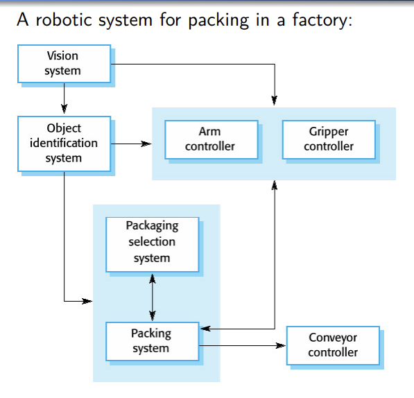
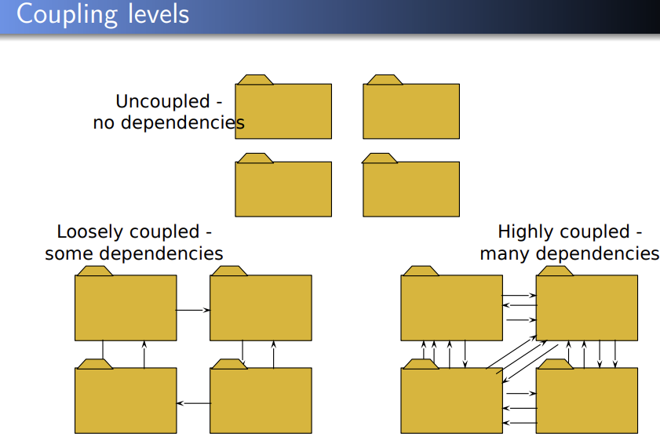

# Introduction to System Design

# System Design

- The purpose of system design is to:
  - Bridge the gap between the system requirements and a system implementation in a manageable way
  - We use "Divide and Conquer"
  - We model the new system to be developed as a set of subsystems

# Summary of this lecture

- Software Design focuses on the solution domain (the implementation). Requirements analysis focus on the problem domain.
- In system design, objects identified during analysis are grouped into subsystems
- The degree of cohesion within and coupling between subsystems can be used to guide subsystem decomposition.

# System Design is

- A creative process
  - no cook book solutions
- Goal driven
  - we create a design for solving some problem
- Constraint driven
  - by the function to be served and the constructions which are possible
- Good designs can be recognised
  - simple, coherent, adequately meets requirements, adaptable

# System Design Process

- transforms the analysis model by
  - defining the **design goals** of the project
  - **decomposing** the system into **smaller subsystems**
  - selection of **off-the-shelf and legacy components**
  - **mapping** subsystems to **hardware**
  - selection of **persistent data management infrastructure**
  - selection of **access control** policy
  - selection of **global control flow** mechanism
  - handling of **boundary conditions**

# Modularity

- "modularity" is the single attribute of software that allows a program to be intellectually manageable
  - Monolithic software (i.e., a large program composed of a single module) cannot be easily grasped by a software engineer
- The number of control paths, span of reference, number of variables, and overall complexity would make understanding close to impossible
- In almost all instances, you should break the design into many modules, hoping to make understanding easier and as a consequence, reduce the cost required to build the software

# Example of system decomposition

# Showing decomposition diagramatically

- Useful for stakeholder communication
- May be used as a focus fo discussion by system stakeholders

- How to do this?
- Simple, informal block diagrams showing entities and relatioonships are the most frequently used method for documenting decomposition

- Sometimes referred to as "box and line diagrams"
  - Very abstract - they do not show the nature of component relationship nor the externally visible properties of the subsystems
  - However, useful for communication with stakeholders and for project planning

# Information Hiding

- Information hiding is the idea that every module should hide aspects of its implementation - exposing only an understandable interface
- Why do this?
  - reduces the likelihood of "side effects"
    - can be unexpected and can cause errors or bugs in a program
  - limits the global impact of local design decisions
  - emphasizes communication through controlled interfaces
  - discourages the use of global data
  - leads to encapsilation - an attribute of high quality design
  - results in higher quality software

# Identifying Subsystems

# Class diagrams in System Design

- A first step in system design is to break down the solution domain into simpler parts
- A subsystem is a collection of classes, associations, operations, events and constraints that are inter-related
- Identifying subsystems usually involves backtracking, evaluation and revision of various solutions
- It is important to get the decomposition right
  - subsystem usually implemented by different teams
  - bad decomposition can lead to unworkable designs

# Heuristics to Identify Subsystems

- Consider the objects and classes in your requirements analysis models
- Try grouping objects into subsystems by:
  - Assigning objects in one use case into the same subsystem
  - create a dedicated subsystem for objects used for moving data among subsystems
  - minimizing the number of associations crossing subsystem boundaries
  - ensure all objects in the same subsystem are functionally related

# Some further criteria

- Primary Question: what kind of service is provided by the subsystems?
- Secondary Question: Can the subsystems be hierarchically ordered (layers)?
- Criteria for selecting subsystems: most of the interaction should be within a subsystem and not across subsystem boundaries (we'll return to this idea)

# Modular design

- A design is modular when
  - each activity of the system is performed by exactly one component
  - inputs and outputs of each component are well-defined, in that every input and output is necessary for the function of that component
  - the idea is to minimise the impact of later changes by abstracting from implementation details

# Coupling and cohesion

- Goal: Reductioon of complexity while change occurs
- Cohesion measures the dependence among classes
  - High cohesion: The classes in the subsystem perform similar tasks and are related to each other (via associations)
  - Low cohesion: Lots of miscellaneous and auxiliary classes, no associations
- Coupling measures dependencies between subsystems
  - High coupling: Changes to one subsystem will have high impact on the other subsystem

# Coupling

- Couping is the strength of dependencies BETWEEN two subsystems
- In general, the fewer dependencies between subsystems the better it is
- Why are fewer dependencies better?
- E.g.
  - 3 subsystems have high coupling with 3rd party database subsystem
  - If database is changed then all 3 subsystem need to be modified
  - What if an extra subsystem is created to handle interface with database?
- By reducing coupling, developers can introduce many unnecessary layers of abstraction that consume development time and processing time

# Coupling levels (bad->good)

- Content coupling: when one module modifies or relies on the internal workings of another module
- Common coupling: when two modules share the same global data
- Control coupling: when one module controlling the logic of another, by passing its information on what to do
- Stamp coupling: when modules share a composite data structure and use only a part of it
- Data coupling: when modules share data through parameters
- Uncoupled: when nothing is shared

# Coherence / Cohesion

- Coherence (or cohesion) is the strength of dependencies WITHIN a subsystem
- In general, the stronger the dependencies within a subsystem the better it is
- Strong coherence is best, middle level is better but low coherence must be avoided

# Coupling levels(good->bad)

- Functional cohesion (best): when parts of a module all contribute to a single well-defined task of the module
- Sequential cohesion: when parts of a module are grouped because the output from one part is the input to another part
- Communicational cohesion: when parts of a module operate on the same data
- Procedural cohesion: when parts of a module always follow a certain sequence of execution
- Temporal cohesion: when parts of a module are grouped when they are processed
- Logical cohesion: when parts of a module are grouped because they logically do "the same thing" in some way
- Coincidental cohesion (worst): when parts of a module are grouped arbitrarily (at random)

# Partitions and layering

- Partitioning and layering are techniques to achieve low coupling
- A large system is usually decomposed into subsystems using both, layers and partitions.
- Partitions divide a system into several independent (or weakly-coupled) subsystems that procide services on the same level of abstraction - i.e. they are on the same "layer"
- A layer is a subsystem that provides subsystem services to a higher layers (level of abstraction)
  - A layer can only depend on lower layers
  - A layer has no knowledge of higher layers

# How dose layering help?

- Supports incremental development of subsystems in different layers
- When a layer interface changes, (potentially) only the adjacent layer is affected

# Summary of this lecture

- Software Design focuses on the solution domain (the implementation). Requirements analysis focuses on the problem domain
- In system design, objects identified during analysis are grouped into subsystems
- The degree of cohesion within and coupling between subsystems can be used to guide subsystem decomposition
